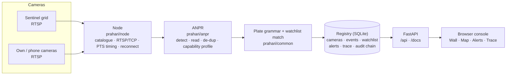

<div align="center">

# PRAHARI

### Integrated Video Management & Analytics Platform

**Gujarat Police Sentinel Hackathon 2026 · Team AlgoX**

*One command. Every camera. Every plate. Every route.*

[Screenshots](#screenshots) · [Quick start](#quick-start) · [Features](#features) · [Architecture](#architecture) · [Submission checklist](#submission-checklist) · [Limitations](#honest-limitations) · [Docs](docs/README.md)

</div>

## Overview

Police control rooms watch hundreds of cameras but can only follow a vehicle by hand, camera by camera. **PRAHARI** turns the Sentinel camera grid into a searchable, alerting system:

1. **Connects** to every camera in the Sentinel catalogue automatically.
2. **Reads** Indian number plates from live video.
3. **Matches** them against a watchlist, tolerant of look-alike characters (0/O, 8/B, 1/I …).
4. **Alerts** operators in real time, separating confident *Alerts* from *Reviews* that a person should confirm.
5. **Traces** any vehicle's route across cameras on a map, with times and speeds. Impossible jumps are flagged, never hidden.

Everything runs on a single laptop with one command and is used from a web browser.

### Declared model: Hybrid

| Layer | Model | Role |
|---|---|---|
| Foundation | **Model 1**: Registry + GIS (mandatory) | Camera registry, map, coverage-gap analysis |
| Spine | **Model 3**: Federation | Cameras and nodes federate into one registry |
| Cameras | **Model 2**: Direct connect | RTSP connection straight to each camera |

Rationale: [`docs/04-architecture-prahari.md`](docs/04-architecture-prahari.md). Strategy and analysis: [`docs/README.md`](docs/README.md).

---

## Features

| Capability | What it does |
|---|---|
| **Automatic camera onboarding** | Sync from the catalogue link, import a CSV, or add a single RTSP camera by hand |
| **Resilient ingestion** | RTSP over TCP, PTS-based timing, automatic reconnect with backoff |
| **Indian plate recognition** | ONNX detector and reader, two-line plate handling, de-duplication |
| **Confusion-aware watchlist matching** | Indian plate grammar plus character-confusion tolerance, tiered as *Alert* vs *Review* |
| **Live alerts** | Real-time alert feed the moment a watchlisted vehicle is seen |
| **Cross-camera trace** | Type a plate, get the route on a map with stop-by-stop times and speeds |
| **GIS and coverage gaps** | Map coloured by camera health, with a toggleable coverage-gap layer and report |
| **Camera capability profiling** | Detects cameras whose plates are too small to read and reports them |
| **Tamper-evident audit log** | Every search requires a purpose and case ID and is written to a hash-chained log |
| **Reports and open API** | Plates report (CSV), audit verification, full OpenAPI docs at `/docs` |
| **Bounded disk use** | Raw video is never stored; evidence crops capped at 300 MB; writes stop below 3 GB free |

### Privacy and accountability by design

- Every trace or search asks for a **purpose** and **case ID**. This is deliberate (accountability and the DPDP Act 2023), not a bug.
- The audit log is **hash-chained**; the Reports page verifies it has not been altered.
- The stream password is used only when a camera connection opens. It is **never** saved to the database, shown on screen, or written to logs.
- No raw video is retained.

---

## Quick start

About 10 minutes. You need Python 3.12 and roughly 300 MB of disk for packages, plus ~11 MB of plate-reading models downloaded on first run.

### 1. Install Python 3.12

From [python.org/downloads](https://www.python.org/downloads/). On Windows, tick **"Add python.exe to PATH"**.

### 2. Install PRAHARI

Open a terminal in this folder.

**macOS / Linux**
```bash
python3 -m venv .venv
source .venv/bin/activate
pip install -r requirements.txt
```

**Windows (PowerShell)**
```powershell
py -3.12 -m venv .venv
.venv\Scripts\Activate.ps1
pip install -r requirements.txt
```

### 3. Try practice mode first

```bash
python run.py demo
```

Open <http://127.0.0.1:8000>. Eight built-in cameras start playing, and a stolen white Swift, `GJ01AB1234`, drives past cameras 1 → 2 → 3 → 4. Within a minute you should see:

- plates being read on the **Wall**,
- red alerts for `GJ01AB1234` and `GJ18BD6612` (both on the sample watchlist),
- on **Trace**, typing `GJ01AB1234` shows its route on the map, camera by camera, with times.

> Practice videos loop every 40 seconds, so the same car passes again each loop. A trace may show repeated stops such as "1, 5, 9" at the same camera. Practice mode uses its own database (`data/demo.db`) and never mixes with real data. Stop with `Ctrl+C`.

### 4. Connect to the real Sentinel grid

The grid needs a login, so three things need setting up.

**a. Create your settings file**
```bash
cp prahari.env.example prahari.env          # Windows: copy prahari.env.example prahari.env
```

**b. Save the camera list.** Log in to the Sentinel portal in your browser, open <https://cctv.corp8.cloud/cameras.json>, and save the page as `sentinel-cameras.json` inside the PRAHARI folder (browser menu → *Save Page As…*, format "Page Source" or "Raw data"). `prahari.env` already points at that file. If the organisers change the camera list, save it again.

**c. Add the stream login** to `prahari.env` (the team's registered email and access password; only emails on the organisers' approved list can connect):
```ini
STREAM_USER=you@example.com
STREAM_PASSWORD=your-access-password
```
Write the email normally; PRAHARI encodes the `@` itself.

> ⚠️ Never commit, upload or share `prahari.env`. Git already ignores it.

### 5. Check everything

```bash
python run.py doctor
```

Checks Python, packages, models, disk, database, the camera list and your stream login, then opens two real camera streams. Every problem comes with a `→` line telling you how to fix it.

### 6. Run it

```bash
python run.py
```

Open the address it prints. All cameras in the catalogue connect automatically.

---

## What you'll see in the browser

| Page | Purpose |
|---|---|
| **Overview** | Cameras live/offline, plate reads, open alerts, system health |
| **Wall** | Every camera's latest picture, with green boxes on plates being read |
| **Map** | Every camera on a map, coloured by health; toggle coverage gaps |
| **Alerts** | Live alerts for watchlisted vehicles. *Alert* = confident; *Review* = a close match a person should confirm |
| **Trace** | Type a plate to see its route on the map, stop by stop, with times and speeds. Impossible jumps are flagged, not hidden |
| **Registry** | All cameras. Add via catalogue sync, CSV import, or by hand. Coverage-gap report |
| **Watchlist** | Add or import vehicles of interest. Ships with a **SAMPLE** list; replace it with your own |
| **Reports** | Download the plates report (CSV); verify the audit log is untampered |

API documentation is served automatically at <http://127.0.0.1:8000/docs>.

---

## Architecture



### Repository layout

| Path | Contents |
|---|---|
| `run.py` | The one command (`demo`, `doctor`, default run) |
| `prahari/node/` | Camera connections: catalogue parsing, RTSP over TCP, PTS timing, reconnect with backoff |
| `prahari/anpr/` | Plate detector and reader (ONNX), two-line handling, de-duplication, camera capability profiling |
| `prahari/common/plate_grammar.py` | Indian plate grammar and confusion-aware watchlist matching |
| `prahari/registry/` | SQLite registry: cameras, events, watchlist, alerts, trace, reports, hash-chained audit log |
| `prahari/api/` | FastAPI app (`/api/...`, docs at `/docs`) |
| `prahari/console/` | The browser console |
| `prahari/runtime.py` | Wires cameras → plate reader → registry → live alerts |
| `sandbox/` | Practice camera grid (`demo_grid.py`, `rtsp_server.py`) |
| `docs/` | Strategy, architecture, requirement scorecard, benchmarks |

---

## Performance and capacity

Measured on an **Apple M1 laptop, 8 GB RAM**:

| Measurement | Result |
|---|---|
| Keeping 48 cameras connected (keyframes mode) | All 48 live, zero reconnects, ~0.5 CPU core, ~400 MB RAM |
| Keeping 48 cameras connected (decoding every frame) | ~1.7 cores, ~560 MB RAM |
| Plate reading | ~15–25 ms per frame |
| **Planned capacity** | **~14 cameras at 1 frame/s per laptop-class machine** |

The raw measurement allows ~40 cameras; we derate ×2 for real footage and keep 40% headroom, so the planning figure is deliberately conservative. Raw logs: [`docs/hld/evidence/`](docs/hld/evidence/).

**If a laptop struggles**, set one of these in `prahari.env`:

```ini
MAX_CAMERAS=20
TARGET_FPS=1
CAPTURE_MODE=keyframes
```

With an NVIDIA GPU: `pip install onnxruntime-gpu` (instead of `onnxruntime`); it is used automatically.

---

## Submission checklist

| Required item | How to produce it |
|---|---|
| Demo on the government feed | `python run.py` with the real link; screen-record the Wall, Alerts and a Trace |
| Output report of detected plates with timestamps | Reports → *Download plates CSV*, or `http://127.0.0.1:8000/api/reports/plates.csv` |
| Demo on your own feed | Add your own camera (below) and run |
| Registry: GIS view, onboarding demo, API docs, gap report | Registry + Map pages; `/docs`; Registry → *Coverage gaps* |
| Designated-vehicle trace on the day | Trace page → type the plate they give you |

### Your own cameras

Any RTSP camera, or a phone running an RTSP camera app, works. Go to **Registry → Add one camera**, enter its `rtsp://` URL and a location, or import a CSV.

---

## Troubleshooting

| Problem | Fix |
|---|---|
| *No camera list set yet* / *Camera list file not found* | Step 4b: save `cameras.json` as `sentinel-cameras.json` in the PRAHARI folder |
| Doctor: *the camera list needs a login* | You pointed `INGEST_URL` at the web address; save the file instead (step 4b) |
| Doctor: *the grid refused the login* | Check `STREAM_USER` / `STREAM_PASSWORD`, and that the email is on the organisers' approved list |
| Doctor: *can't read the catalogue* | Open the URL in a browser on the same computer. If that fails too, it's the network or VPN, not PRAHARI |
| Doctor: *could not open the stream* | Port 8554 may be blocked (office and college Wi-Fi often block it). Try another network, e.g. a phone hotspot |
| Missing Python package | Activate the venv (step 2), then `pip install -r requirements.txt` |
| Port 8000 is already in use | Set `PORT=8001` in `prahari.env` |
| Wall pictures stay blank | That camera isn't delivering video. Check its status dot, then run `python run.py doctor` |
| No plates read on one camera | It may be a corridor or gate, or its plates are too small; the system measures this and shows it in the camera's details |
| macOS prints `objc ... AVFFrameReceiver is implemented in both` | Harmless. Two video libraries both ship a macOS webcam helper we don't use |
| Want a clean start | Stop it, delete the `data/` folder, start again |

Detailed logs: `PRAHARI_LOG=INFO python run.py` (PowerShell: `$env:PRAHARI_LOG="INFO"; python run.py`).

---

## Honest limitations

We would rather state these than have them discovered on the day.

- **Plate reading was tested on synthetic plates.** Real CCTV (night, glare, dirt, motion blur, hand-painted plates) will be harder. Two-line two-wheeler plates are often missed today.
- **Small plates:** plates under ~24 pixels tall cannot be read reliably. The system detects such cameras and reports them rather than failing silently.
- **Appearance-based re-identification** (matching a vehicle across cameras when its plate is unreadable) is designed but not yet built.
- **Operator authentication:** operator identity is not authenticated yet. PRAHARI is for a controlled demo, not open deployment.

### Roadmap

1. Operator authentication and role-based access
2. Appearance-based vehicle re-identification
3. Fine-tuning on real CCTV footage, including night and two-wheeler plates
4. Multi-node federation across districts

---

## For developers

```bash
pip install -r requirements-dev.txt
python -m pytest tests/ -q
python bench/bench_plate_matching.py
python -m prahari.node.stability --catalogue URL --seconds 120
```

`scripts/clean.sh` removes everything that can be regenerated.

---

<div align="center">

**PRAHARI** · Built for the Gujarat Police Sentinel Hackathon 2026

*Team: AlgoX · Contact: agrajsingh2401@gmail.com*

</div>
