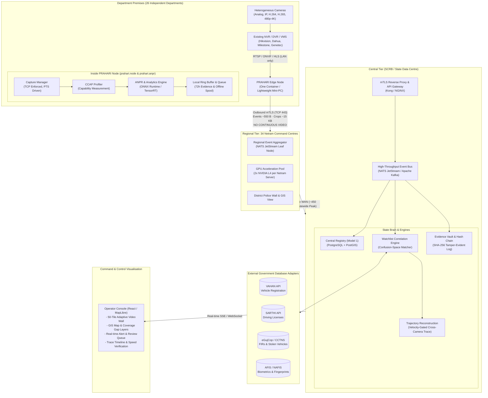
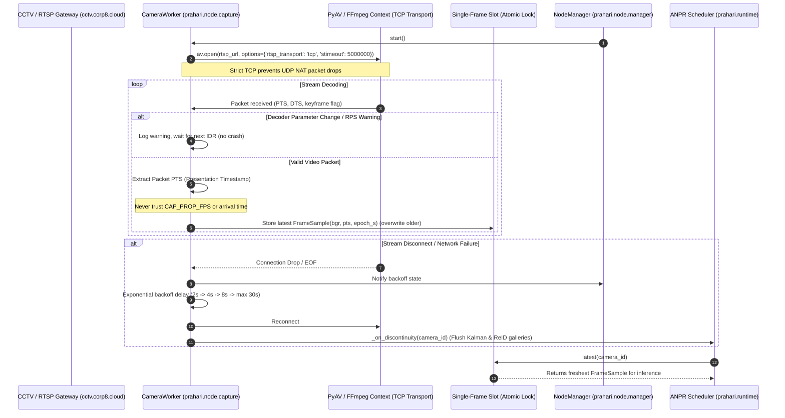
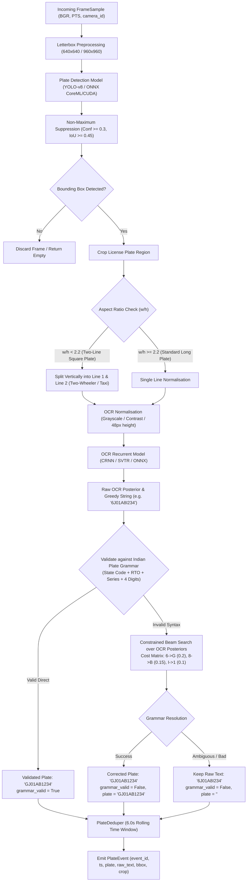
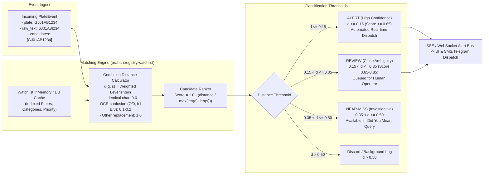
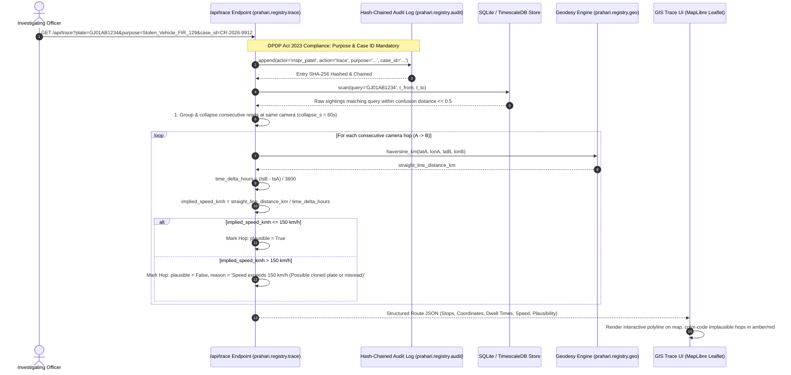
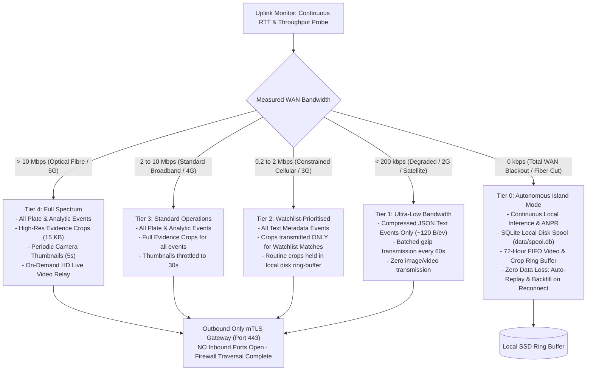
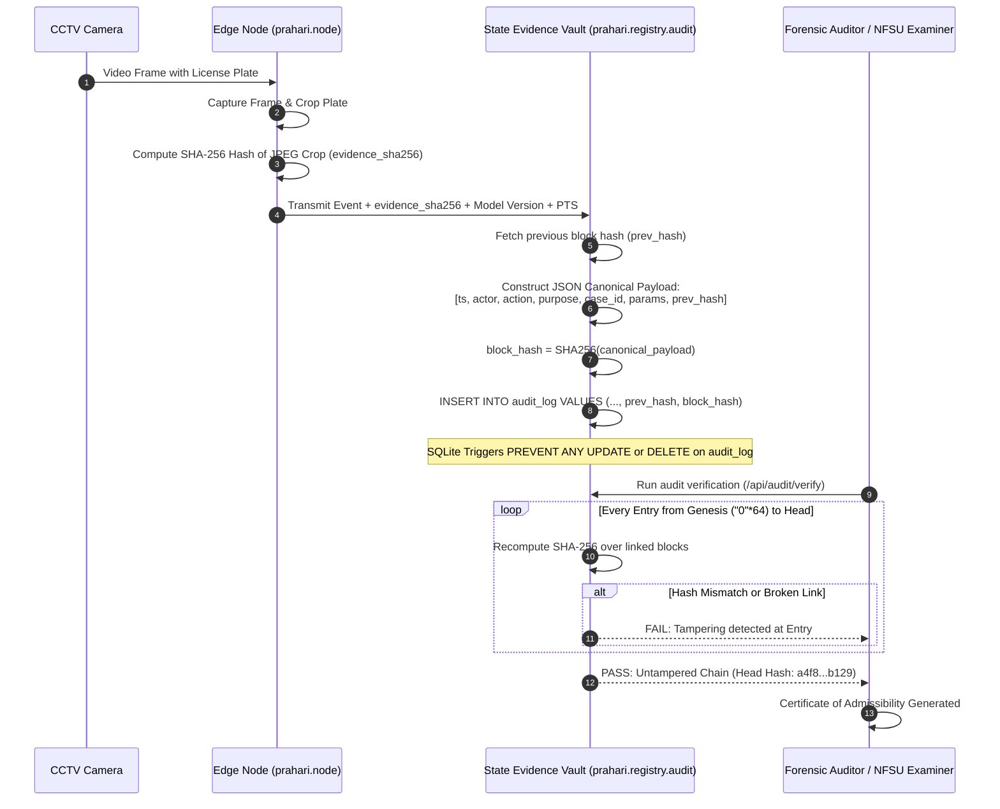
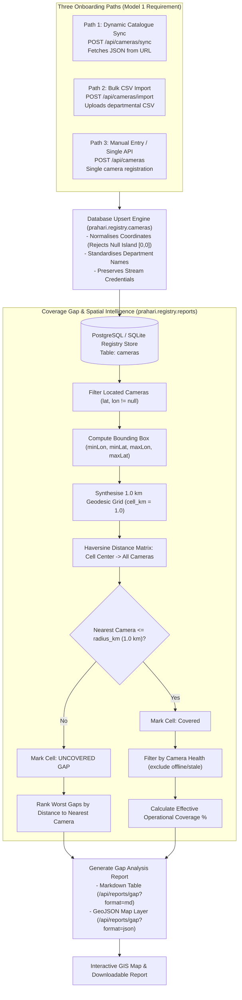
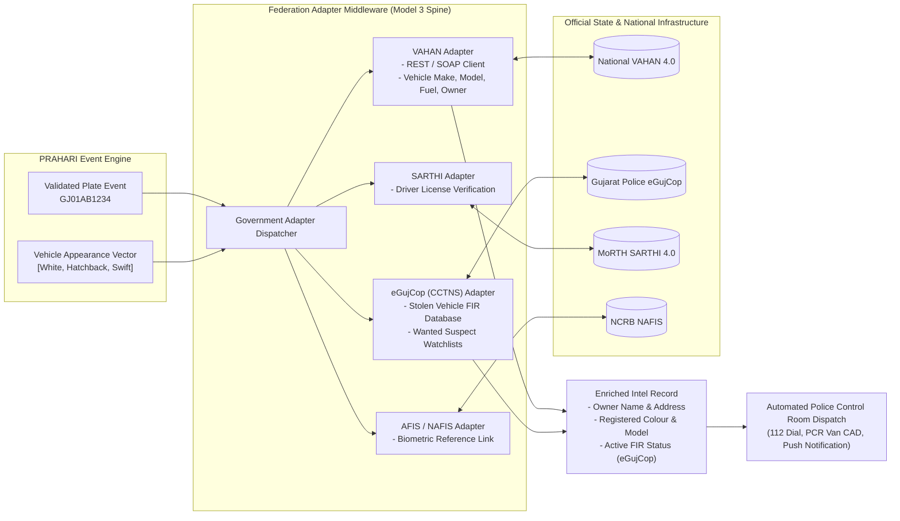

# PRAHARI — Complete Workflow & Integration Diagrams
**Gujarat Police Sentinel Hackathon 2026 · Integrated Video Management & Analytics Platform**

> **Core System Thesis:** *Move meaning, not megabytes.* Video stays where it is born. Only structured observations cross the state. The registry is the brain.
>
> This document details the technical workflows, data pipelines, and architectural integration boundaries of **PRAHARI**, directly derived from the production codebase (`prahari/`).

---

## 1. System-Wide Tiered Topology & Multi-Department Integration

PRAHARI implements **Hybrid Model 5** (Model 1 Registry + Model 3 Federation Middleware + Model 2 Direct Ingest for unmanaged streams). 
Video never leaves departmental premises unless an explicit, signed clip-pull request with an active Case ID is issued.



---

## 2. Camera Feed Ingestion & Capture Worker Loop (`prahari.node.capture`)

The ingestion pipeline handles non-uniform frame arrivals, GOP replays on reconnect, and prevents memory leaks using single-frame drop buffers.



---

## 3. Camera Capability Auto-Profiling (CCAP) Lifecycle (`prahari.anpr.ccap`)

CCAP solves the core real-world challenge: heterogeneous cameras across 26 departments (e.g. hospital corridors vs toll gates). 
It actively profiles cameras and automatically allocates compute only where plates can physically be read.

```mermaid
stateDiagram-v2
    [*] --> Accumulating: Camera Onboarded
    
    state Accumulating {
        [*] --> SamplingFrames: Capture Frames
        SamplingFrames --> ExtractingMetrics: Run YOLO & OCR
        ExtractingMetrics --> UpdatingStats: Update frames, plates, bbox heights, valid rates
    }

    Accumulating --> Evaluating: frames >= 30 AND plates >= 5
    Accumulating --> InsufficientData: frames < 30 OR plates < 5

    state Evaluating {
        [*] --> CheckPixelHeight: Calculate Median Plate Pixel Height (plate_px_median)
        
        CheckPixelHeight --> UnviableHeight: plate_px_median < 24 px
        note right of UnviableHeight: Heuristic: Single-line exact-read rate drops below 40% under 24px
        
        CheckPixelHeight --> CheckLegibility: plate_px_median >= 24 px
        
        CheckLegibility --> UnviableLegibility: valid_rate < 0.33
        note right of UnviableLegibility: More than 67% reads fail Indian Plate Grammar (Glare, Angle, Dirt)
        
        CheckLegibility --> ViableOK: valid_rate >= 0.33
    }

    UnviableHeight --> MarkUnviable: Set anpr_viable = False
    UnviableLegibility --> MarkUnviable: Set anpr_viable = False
    ViableOK --> MarkViable: Set anpr_viable = True

    MarkViable --> DynamicScheduler: Sample every 1 frame (Full Rate)
    MarkUnviable --> DynamicScheduler: Sample 1 frame in 10 (Conserve 90% GPU budget)
    InsufficientData --> DynamicScheduler: Sample every 1 frame (Collecting Evidence)
```

---

## 4. ANPR Detection, Two-Line Handling & Grammar-Constrained OCR Pipeline

This diagram shows how raw pixels are transformed into grammatically validated license plates using `prahari.anpr.pipeline` and `prahari.common.plate_grammar`.



---

## 5. Confusion-Space Watchlist Matching Engine (`prahari.registry.watchlist`)

Unlike naive systems that use brittle `SELECT * WHERE plate = ocr` queries, PRAHARI computes OCR-confusion-weighted edit distances and delivers graded alert tiers.



---

## 6. Cross-Camera Re-ID & Velocity-Gated Trajectory Reconstruction (`prahari.registry.trace`)

When tracing a suspect vehicle across Gujarat's highway grid, PRAHARI connects sightings, bridges unreadable plates with vehicle appearance, and physically validates each hop against road physics.



---

## 7. Zero-Inbound Outbound mTLS & Bandwidth Ladder (`prahari.node.manager`)

How PRAHARI functions reliably even in remote tribal blocks (Dahod, Dangs) and border outposts with unstable 2G/4G connectivity.



---

## 8. Cryptographic Chain-of-Custody & Tamper-Evident Audit Log (`prahari.registry.audit`)

Designed specifically for the National Forensic Sciences University (NFSU) evaluators and Section 65B Bharatiya Sakshya Adhiniyam compliance.



---

## 9. Model 1 Central Registry Onboarding & Geospatial Coverage Gap Analysis (`prahari.registry.reports`)

Demonstrating compliance with Mandatory Model 1 requirements: 3 onboarding paths, interactive GIS layers, and spatial gap reports.



---

## 10. Multi-Agency Government Database Federation Interface

How PRAHARI bridges live edge surveillance with national and state databases (VAHAN, SARTHI, eGujCop, AFIS/NAFIS).


