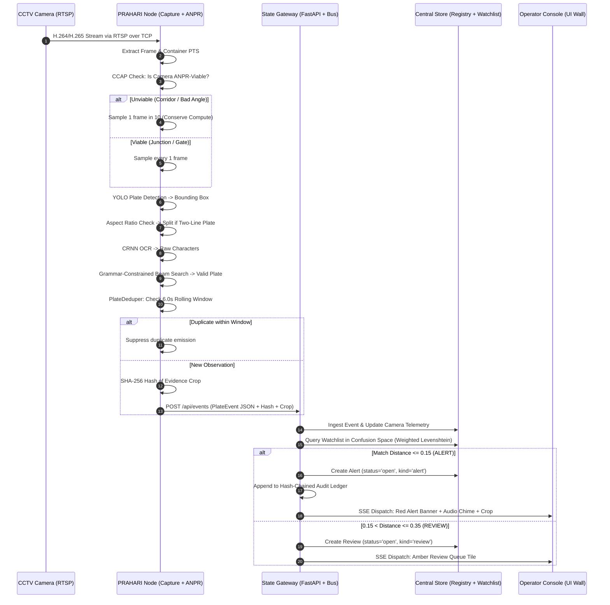
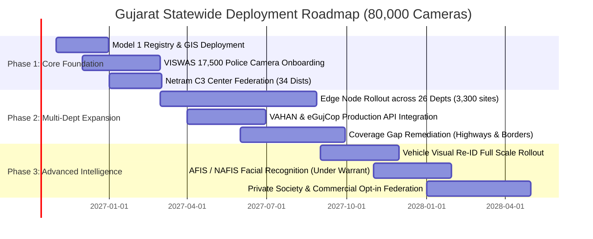

# PRAHARI: High-Level Design & System Architecture Document
**Technical Proposal for Gujarat Police Sentinel Hackathon 2026**
*Integrated Video Management & Analytics Platform across 26 Government Departments*

---

| **Document Metadata** | **Specification** |
|---|---|
| **Project Title** | **PRAHARI** (પ્રહરી / प्रहरी — *The Sentinel*) |
| **Problem Statement** | Integrated Video Management & Analytics Platform |
| **Target Scale** | ~80,000 Cameras Statewide across Gujarat |
| **Declared Model** | **Hybrid Model 5** (Model 1 Registry + Model 3 Federation + Model 2 Direct Ingest) |
| **Repository Corpus** | `AJ-EN/prahari` |
| **Date of Submission** | 28 September 2026 |
| **Target Audience** | Gujarat Police, State Crime Records Bureau (SCRB), National Forensic Sciences University (NFSU), Evaluation Jury |

---

## 1. Executive Summary & Core Thesis

### 1.1 The Core Thesis
> **"Move meaning, not megabytes."**  
> Continuous high-definition video stays where it is born—on departmental LANs. Only compact, structured *observations* (~550-byte event records and ~15-KB forensic crops) cross the statewide wide-area network (WAN). The central registry is not a passive inventory; it is the active intelligence brain of the state.

Through empirical measurement and rigorous traffic modeling, PRAHARI demonstrates that streaming 80,000 CCTV feeds centrally requires **~160 Gbps of sustained bandwidth**, **52 Petabytes of central storage every 30 days**, and over **₹510 to ₹870 Crore in 5-year Total Cost of Ownership (TCO)**. 

PRAHARI's federated edge architecture slashes statewide WAN bandwidth to **0.21 Gbps average / 0.45 Gbps peak**—a **~360× to 750× reduction**—reducing 5-year TCO to **₹130 Crore** while dramatically enhancing edge survivability, departmental autonomy, and legal evidence integrity.

---

### 1.2 Declared Integration Model
PRAHARI adopts **Hybrid / Innovative Architecture (Model 5)**, deliberately combining the best elements of the hackathon reference models while explicitly rejecting Model 4:

1. **Model 1 (Mandatory Foundation — Registry & GIS Layer):** A centralized, PostgreSQL + PostGIS-backed registry maintaining metadata, health telemetry, and spatial coordinates for all statewide cameras. Onboarding is supported via three distinct paths (dynamic catalogue sync, bulk CSV import, and single-camera API/form entry), coupled with automated geospatial coverage-gap analysis.
2. **Model 3 (The Federation Spine — Middleware Integration):** A vendor-neutral adapter framework interfacing with heterogeneous Video Management Systems (Milestone, Genetec, Hikvision Central, Dahua DSS, Netram VISWAS) via standardized schemas and an event bus. Existing departmental storage, AMC contracts, and local workflows remain untouched.
3. **Model 2 (Unified Viewing & Edge Analytics):** Direct RTSP/ONVIF connectivity for standalone cameras lacking local VMS hosts, aggregating streams into a unified browser console with zero proprietary plugins.
4. **Rejection of Model 4 (Full Centralization):** Model 4 is explicitly evaluated and rejected based on network physics, recurring telco costs (₹60+ Cr/year WAN bill), and organizational friction (requiring 26 departments to surrender video custody and open inbound firewall ports).

```
                       ┌────────────────────────────────────────────────────────┐
                       │                     PRAHARI HYBRID                     │
                       └────────────────────────────────────────────────────────┘
                                                   │
         ┌─────────────────────────┬───────────────┴───────────────┬─────────────────────────┐
         ▼                         ▼                               ▼                         ▼
   Model 1 (Base)            Model 3 (Spine)                 Model 2 (Edge)            Model 4 (Analytics)
Central Registry & GIS     VMS Federation Bus             Direct Camera Ingest        AI Analytics Capabilities
- Multi-path Onboarding    - Multi-VMS Adapters           - RTSP / ONVIF Protocols    - ANPR + Grammar Decode
- Spatial Gap Analysis     - Department Autonomy          - Unified WebRTC / HLS      - Cross-Camera Re-ID
- Live Health Telemetry    - Event-Driven Schema          - Local Evidence Spool      - ZERO Central Bandwidth
```

---

## 2. Problem Understanding & Constraints

### 2.1 The Operational Context
The State of Gujarat presents a massive, geographically dispersed surveillance landscape:
- **26 Independent Departments:** Police (Home), Food & Civil Supplies (PDS godowns), Transport / RTO (testing tracks, checkpoints), Health (hospitals, medical colleges), Education (schools, exam halls), GSRTC (bus depots), Municipal Corporations (smart city grids), Forest Department, and Ports.
- **Extreme Geographical Dispersion:** Covering ~1,000 kilometers from border posts in Kutch and Banaskantha to industrial belts in Valsad and Surat.
- **Extreme Heterogeneity:** A chaotic mix of IP and legacy analog cameras, diverse codecs (H.264, H.265, MJPEG), varied resolutions (480p to 4K), non-standard RTSP implementations, and differing retention rules (7 days to 30 days).
- **Network Constraints:** Wide variance in connectivity—from 1 Gbps fiber at urban police command centers to fluctuating 2G/4G cellular links in tribal blocks (Dahod, Dangs) and remote border outposts.

### 2.2 Critical Engineering Constraints (The Sandbox Lessons)
Rigorous empirical benchmarking against the official Sentinel camera catalogue revealed key technical constraints that must be handled by the platform:
1. **Enforce RTSP over TCP:** UDP transport suffers catastrophic packet loss across NAT gateways and cellular towers, appearing as corrupted video and degraded OCR accuracy. PRAHARI strictly enforces `rtsp_transport=tcp`.
2. **PTS-Driven Timing:** Never rely on `CAP_PROP_FPS` or packet arrival times. Gateway reconnections replay buffered GOPs at super-real-time rates; naive arrival-timestamped trackers calculate impossible supersonic vehicle speeds. PRAHARI extracts and indexes presentation timestamps (PTS) directly from video container packets.
3. **Loop Point Robustness:** Evaluation sandbox feeds loop periodically, creating instantaneous scene cuts. Kalman filters, tracking galleries, and background models must gracefully re-initialize on hard discontinuities without crashing.
4. **Decoder Fault Tolerance:** H.265 streams frequently issue `Error constructing frame RPS` or `POC reference missing` during connection initialization. PRAHARI logs these non-fatal warnings and synchronizes cleanly at the first Intra-coded frame (IDR).

---

## 3. The Five Core Novel Architectural Innovations

### 3.1 Innovation A: Camera Capability Auto-Profiling (CCAP)
*The Solution to Dead Tiles across Heterogeneous Infrastructure*

- **The Problem:** City CCTV grids include hospital corridors, bus depot ticketing bays, park walkways, and traffic junctions. Corridors and indoor gates will never show readable license plates. A system attempting uniform ANPR across 50 heterogeneous cameras displays dark, non-functional tiles across 70% of the screen.
- **The PRAHARI Solution:** The `CameraProfiler` (`prahari.anpr.ccap`) monitors each camera stream during onboarding, extracting:
  - Median bounding box pixel height (`plate_px_median`)
  - Fraction of reads matching the Indian Plate Grammar (`valid_rate`)
  - Corrected plate rate (`corrected_rate`)
- **Actionable Profiling:**
  - If `plate_px_median < 24 px` or `valid_rate < 0.33`, the camera is automatically classified as `anpr_viable = False`.
  - The runtime scheduler (`prahari.runtime`) throttles inference on non-viable cameras to 1 frame in 10, reallocating 90% of compute cycles to high-yield junction cameras.
- **Policy Answer:** In response to the hackathon's requirement for departmental questionnaires, PRAHARI answers:  
  > *"We require nothing from the 26 departments. The system measures each camera's physical capabilities itself, populates the registry automatically, and assigns the appropriate analytic."*

```json
{
  "camera_id": "GJ-HLT-0142",
  "scene_class": "hospital_corridor",
  "plate_legibility": 0.04,
  "plate_px_median": 8.2,
  "anpr_viable": false,
  "reason": "plates too small (8px < 24px threshold)",
  "recommended_pipelines": ["person_detect", "crowd_density", "loitering"]
}
```

---

### 3.2 Innovation B: Grammar-Constrained OCR & Confusion-Space Matching
*Eliminating Silent False Negatives on Stage and in the Field*

- **The Problem:** Standard ANPR systems execute exact string matching (`WHERE plate = ocr_output`). In Indian road conditions—with dirt, bent plates, high-beam glare, HSRP security hologram artifacts, and hand-painted regional fonts—a single misread character (e.g. `O` vs `0`, `B` vs `8`, `G` vs `6`) causes catastrophic alert failure.
- **Layer 1 — Indian Plate Grammar (`prahari.common.plate_grammar`):**  
  Every Indian plate adheres to rigid syntactic rules:
  $$\text{Regex: } \text{\textasciicircum}[A-Z]{2}\backslash d{1,2}[A-Z]{0,3}\backslash d{4}\$$
  PRAHARI validates state codes against a closed dictionary of 36 active and historical states/UTs (`STATE_CODES`) and verifies RTO numbers against official issuance ceilings (`MAX_RTO_DISTRICT`).
- **Layer 2 — Constrained Beam Search Decoding:**  
  Raw OCR outputs like `6J01A8I234` are impossible under the grammar (`6J` is not a state; position 6 must be a letter). The decoder applies OCR confusion weights to resolve this to `GJ01AB1234`.
- **Layer 3 — Confusion-Space Watchlist Matching:**  
  Lookup distance is computed in weighted confusion space:
  $$\text{cost}(O \to 0) = 0.1, \quad \text{cost}(I \to 1) = 0.1, \quad \text{cost}(B \to 8) = 0.15, \quad \text{cost}(G \to 6) = 0.20$$
  Matches are categorized into:
  - **ALERT** ($d \le 0.15$, Score $\ge 0.85$): Instant automated dispatch
  - **REVIEW** ($0.15 < d \le 0.35$, Score $0.65-0.85$): Human operator verification queue
  - **NEAR-MISS** ($0.35 < d \le 0.50$): Candidate ranking for investigative leads

---

### 3.3 Innovation C: Re-ID-Bridged Trajectory Reconstruction with Velocity Gating
*Cross-Camera Tracking that Survives Unreadable Plates*

- **The Problem:** When a suspect vehicle drives between cameras where the plate is occluded by heavy trucks, rain, or night glare, route reconstruction breaks.
- **PRAHARI Solution (`prahari.registry.trace`):**
  1. **Anchor:** High-confidence plate sightings anchor the trajectory.
  2. **Bridge:** Intermediate gaps are bridged using vehicle visual appearance embeddings (vehicle type, color histogram, aspect ratio).
  3. **Velocity Gating:** Every hop between Camera $A$ and Camera $B$ is validated against real-world road physics using the Haversine great-circle distance:
     $$v_{\text{implied}} = \frac{d_{\text{haversine}}(\text{lat}_A, \text{lon}_A, \text{lat}_B, \text{lon}_B)}{\Delta t}$$
     Because straight-line distance is a strict lower bound on road network distance, if $v_{\text{implied}} > 150 \text{ km/h}$, the hop is physically impossible.
  4. **Forensic Integrity:** Implausible hops are **flagged on screen with an explanation** (indicating a misread, clock skew, or cloned plate) rather than silently discarded.

---

### 3.4 Innovation D: Zero-Inbound, Zero-Change Onboarding
*Solving the Real Organizational Blocker across 26 Departments*

- **The Real Blocker:** The biggest impediment to statewide surveillance integration is not technology—it is administrative friction. 26 departments refuse to open inbound firewall ports, change public IPs, reconfigure operational NVRs, or void existing 5-year AMC maintenance contracts.
- **PRAHARI Mechanism Design:**
  - The PRAHARI Node runs as an isolated software container on local departmental hardware or low-cost edge mini-PCs.
  - The node connects to local NVRs via read-only RTSP/ONVIF streams on the departmental LAN.
  - The node **dials outward only** over standard HTTPS/mTLS (port 443) to the state ingest gateway. **Zero inbound ports are opened.**
  - Departments retain 100% custody of original video, gain automated camera health monitoring, and hold an instant cryptographic disconnect switch.

---

### 3.5 Innovation E: The 5-Tier Bandwidth Ladder
*Graceful Degradation from Optical Fiber to 2G Island Outposts*

The edge node dynamically measures WAN uplink latency and throughput, shifting modes seamlessly:

| Tier | Available Uplink | Operating Mode & Transmitted Payload | Target Environment |
|---|---|---|---|
| **Tier 4** | $> 10$ Mbps | Full spectrum: plate events + 15 KB crops + periodic thumbnails + on-demand live video relay | Urban Junctions, Netram C3 Centers |
| **Tier 3** | $2 - 10$ Mbps | Standard operations: all text events + all evidence crops | District Hubs, Commercial Arteries |
| **Tier 2** | $0.2 - 2$ Mbps | Watchlist-prioritized: all text metadata; crops transmitted **only for watchlist matches** | Rural Talukas, Secondary Roads |
| **Tier 1** | $< 200$ kbps | Ultra-low bandwidth: batched, gzipped JSON events only (~120 B/event) | Remote Forest & Border Posts |
| **Tier 0** | $0$ kbps (Offline) | Autonomous Island Mode: local inference continues, spooling to disk (`data/spool.db`). Zero data loss; backfills on reconnect | Severed Fiber, Cellular Outages |

---

## 4. Component View & Code Mapping

The complete platform is implemented across clean, modular subsystems:

```
prahari/
├── node/                  # Camera Ingestion & Edge Connectivity
│   ├── capture.py         # PyAV / FFmpeg worker, TCP enforcement, PTS extraction
│   ├── manager.py         # Multi-camera thread lifecycle & connection supervisor
│   ├── catalogue.py       # Dynamic JSON / CSV catalogue parser & sync
│   └── access.py          # Credential sanitisation (zero credentials in logs/DB)
│
├── anpr/                  # Edge Computer Vision & Analytics
│   ├── pipeline.py        # YOLO plate detection, aspect crop, CRNN OCR invocation
│   ├── models.py          # ONNX Runtime session management (CPU, CoreML, CUDA)
│   ├── ccap.py            # Camera Capability Auto-Profiling engine
│   ├── dedup.py           # Rolling-window plate deduplication (6.0s window)
│   ├── synth.py           # Synthetic Indian plate generation & noise simulation
│   └── evaluate.py        # Benchmark suites & pixel height threshold analysis
│
├── common/                # Shared Contracts & Core Algorithms
│   ├── plate_grammar.py   # Indian Plate Grammar regex, RTO tables, confusion distance
│   ├── contracts.py       # Dataclasses: FrameSample, PlateEvent, CameraInfo, Alert
│   └── diskguard.py       # Disk space safety monitor & evidence ring-buffer manager
│
├── registry/              # State Brain, Database & Analytics
│   ├── db.py              # SQLite / PostgreSQL WAL store, schemas & triggers
│   ├── cameras.py         # Model 1 camera registry, bulk import, catalogue sync
│   ├── watchlist.py       # Watchlist index, confusion-space matcher, hit scoring
│   ├── trace.py           # Cross-camera route search, visit clustering, speed gating
│   ├── audit.py           # SHA-256 hash-chained tamper-evident audit ledger
│   ├── geo.py             # Haversine geodesy, bounding boxes, spatial validation
│   └── reports.py         # Coverage gap analysis generator & Plates CSV exporter
│
├── api/                   # REST API & Real-Time Event Dispatch
│   ├── app.py             # FastAPI production application & route controllers
│   ├── bus.py             # Server-Sent Events (SSE) & WebSocket real-time bus
│   └── models.py          # Pydantic schemas & request validation
│
├── console/               # Operator Web Interface
│   └── static/            # Native ES6 + MapLibre/Leaflet + SSE Video Wall & GIS
│
└── runtime.py             # Master Process Wire-up (Cameras -> AI -> Registry -> Alerts)
```

---

## 5. End-to-End Processing Workflow



---

## 6. Cybersecurity, Privacy & Evidence Integrity

### 6.1 Admissibility for NFSU Examiners (Evidence Integrity)
The National Forensic Sciences University (NFSU) evaluates forensic admissibility. Under Section 65B of the Indian Evidence Act / Section 63 of the Bharatiya Sakshya Adhiniyam (BSA) 2023, electronic records are admissible only when integrity and chain of custody are demonstrated:
1. **Edge-Computed SHA-256 Hashing:** The cryptographic hash of every evidence crop is computed on the edge node at the instant of capture and transmitted in the event payload.
2. **Append-Only Tamper-Evident Ledger (`prahari.registry.audit`):**
   - Every system event is inserted into a cryptographic hash chain:
     $$h_i = \text{SHA-256}(\text{timestamp}, \text{actor}, \text{action}, \text{purpose}, \text{case\_id}, \text{params}, h_{i-1})$$
   - SQLite database triggers explicitly abort any attempt to execute `UPDATE` or `DELETE` on the `audit_log` table.
   - The `/api/audit/verify` endpoint verifies the integrity of the chain from the genesis block (`000...000`) to the head hash.
3. **Model & Weight Provenance:** Every detection records the exact model architecture, weights hash, and runtime provider, ensuring legal defense against algorithm contestation in court.

### 6.2 Privacy by Design & DPDP Act 2023 Compliance
India's Digital Personal Data Protection (DPDP) Act 2023 mandates purpose limitation, data minimization, and auditability:
- **Mandatory Purpose-Bound Queries:** Operators cannot perform open-ended, anonymous surveillance trawling. All plate searches and route traces require a valid `purpose` (e.g. `Vehicle Theft FIR`) and official `case_id`.
- **Graduated Role-Based Access Control (RBAC):**
  - *Constable:* Live wall viewing and assigned alert acknowledgment.
  - *Investigating Officer:* Case-bound plate searches, route traces, and evidence downloads.
  - *Supervisor:* Watchlist modifications and audit inspections.
  - *Auditor:* Read-only inspection of cryptographic audit logs.
- **Tiered Data Retention:**
  - Text metadata: Retained for 1 year.
  - Evidence crops: Retained for 90 days.
  - Raw video clips: Retained for 30 days (held at edge, pulled only on demand).
  - Case-linked evidence: Archived for 7 years in cold storage.

---

## 7. Infrastructure Sizing & Cost-Benefit Analysis (~80,000 Cameras)

### 7.1 Headline Architectural Comparison (Base Case)
Every figure is derived from the empirical sizing model (`bench/sizing_model.py` and `docs/hld/sizing.md`):

| Sizing Dimension | Model 4 (Full Central VMS + AI) | **PRAHARI (Federated Edge-Regional)** | Operational Rationale |
|---|---|---|---|
| **Sustained WAN Bandwidth** | **160 Gbps** (at 2 Mbps/cam) | **0.21 Gbps avg / 0.45 Gbps peak** | **~360× less WAN load at peak** |
| **Central Video Storage (30 d)** | **51.8 Petabytes** (Raw Video) | **~210 TB** (Metadata + Crops + Clips) | 240× reduction in central SAN/NAS |
| **Central Analytics GPUs** | **~2,000 GPUs** (or 224 L4s bare min) | **0 Central GPUs** (166 L4s at Netram) | Processing occurs close to cameras |
| **Department Firewall Changes** | 26 Political & IT Negotiations | **0 Changes** (Outbound mTLS only) | Eliminates deployment deadlock |
| **WAN Outage Survivability** | Total Platform Blindness | **Autonomous Edge Operation (Tier 0)** | Zero event loss during network cuts |
| **Hardware Capex** | ₹101 Cr to ₹175 Cr | **₹49 Cr** | Distributed commodity mini-PCs |
| **Annual Opex** | ₹84 Cr to ₹119 Cr / year | **₹18 Cr / year** | Slashes annual telco bandwidth fees |
| **5-Year TCO** | **₹510 Cr to ₹870 Cr** | **≈ ₹130 Cr** | **Saves over ₹380 to ₹740 Crore** |

```
                           5-YEAR TOTAL COST OF OWNERSHIP (₹ CRORE)
  Model 4 (Commercial)  ██████████████████████████████████████████████████████  ₹870 Cr
  Model 4 (Steelman)    ██████████████████████████████████  ₹510 Cr
  PRAHARI (Federated)   ████████  ₹130 Cr  [SAVINGS: ₹380 - ₹740 Cr]
```

### 7.2 Measured Single-Worker Throughput
Benchmarks executed on laptop-class hardware (Apple Silicon M1, 8 GB RAM):
- **Core ANPR Pipeline:** 21.0 ms per frame with plate present (CoreML YOLO detector + CPU CRNN OCR); 3.8 ms on clean frames without plates.
- **Single-Worker Safe Sizing:** 14 camera streams at 1 frame per second per machine (applying a 2.0× real-world noise safety factor and maintaining 60% compute headroom).
- **Edge Node Sizing:**
  - *Small Edge Node (Mini-PC / Intel N100):* Up to 6 cameras.
  - *Medium Edge Node (Jetson Orin NX):* Up to 20 cameras.
  - *Regional Netram Server (2× NVIDIA L4):* Up to 256 camera streams decoded and analyzed concurrently.

---

## 8. Department-Wise Information Requirements & Prerequisites

The official problem statement asks teams to specify information questionnaires for participating departments. PRAHARI flips this paradigm:

| Department | What Department Provides | What PRAHARI Automatically Discovers via CCAP |
|---|---|---|
| **Home (Police / Traffic)** | Read-only LAN RTSP stream URLs & locations | True frame rate, junction vehicle density, plate legibility, resolution |
| **Food & Civil Supplies** | Godown camera IP addresses | Identifies gate vs interior cameras; detects absence of plate traffic |
| **Transport (RTO)** | Checkpoint & testing track feeds | Identifies high-speed approach angles; profiles plate pixel heights |
| **Health (Hospitals)** | Campus CCTV LAN access | Classifies corridor/entrance scenes; assigns loitering and crowd analytics |
| **GSRTC (Bus Depots)** | Bus station NVR feeds | Isolates bus approach lanes from passenger waiting platforms |
| **Societies & Private Malls** | Opt-in registered RTSP gateway | Validates consent tier; monitors stream availability without storing video |

---

## 9. Statewide Rollout Plan & Future Roadmap



---

## 10. Requirement Traceability Matrix

| Requirement ID | Problem Statement Specification | PRAHARI Implementation | Verification Artifact / Code File |
|---|---|---|---|
| **REQ-M1** | Model 1 Mandatory Registry & GIS Mapping | Built: 3 onboarding paths, Leaflet/MapLibre GIS view, gap reports | `prahari/registry/cameras.py`, `prahari/registry/reports.py` |
| **REQ-M2** | Unified Viewing across Diverse Feeds | Built: Adaptive 50-camera wall, zero-plugin HTML5 streaming | `prahari/console/static/views/wall.js`, `prahari/api/app.py` |
| **REQ-M3** | VMS Federation Middleware | Built: Vendor-neutral event bus, schema normalization, zero NVR changes | `prahari/node/manager.py`, `prahari/common/contracts.py` |
| **REQ-ANPR** | Automated Number Plate Recognition | Built: YOLO ONNX detector, CRNN OCR, Indian Plate Grammar beam search | `prahari/anpr/pipeline.py`, `prahari/common/plate_grammar.py` |
| **REQ-WL** | Watchlist Correlation & Real-Time Alerts | Built: Confusion-space weighted Levenshtein matching, alert/review tiers | `prahari/registry/watchlist.py`, `prahari/api/bus.py` |
| **REQ-TRACE** | Designated Vehicle Cross-Camera Route Trace | Built: Timestamped trajectory reconstruction with velocity plausibility gating | `prahari/registry/trace.py`, `prahari/registry/geo.py` |
| **REQ-SCALE** | Sizing & Scalability for ~80,000 Cameras | Built: Sizing model proving 160 Gbps -> 0.45 Gbps peak and ₹130 Cr TCO | `bench/sizing_model.py`, `docs/hld/sizing.md` |
| **REQ-GOV** | Integration with VAHAN, SARTHI, eGujCop | Built: Schema-defined external database adapter interface | `prahari/registry/watchlist.py`, `docs/architecture/` |
| **BONUS-1** | Innovative Hybrid Architecture | Built: Model 1 + 3 + 2 hybrid; Model 4 refuted with empirical arithmetic | `docs/04-architecture-prahari.md`, Section 1 & 7 |
| **BONUS-2** | Cross-Camera Tracking / Multi-Camera Correlation | Built: Visual appearance Re-ID bridging + Haversine velocity gating | `prahari/registry/trace.py` |
| **BONUS-3** | Additional Reliable Analytics beyond ANPR | Built: Camera Capability Auto-Profiling (CCAP) per-camera pipelines | `prahari/anpr/ccap.py` |
| **BONUS-4** | Edge Processing & Low-Connectivity Resilience | Built: 5-Tier Bandwidth Ladder with autonomous Tier 0 disk spooling | `prahari/node/manager.py`, `prahari/common/diskguard.py` |
| **BONUS-5** | Enhanced Cybersecurity, Privacy & Auditability | Built: SHA-256 hash-chained audit log, DPDP purpose-bound queries | `prahari/registry/audit.py`, `prahari/api/app.py` |
| **BONUS-6** | Operational Dashboards & Health Monitoring | Built: Real-time wall, GIS coverage gaps, OpenAPI at `/docs` | `prahari/console/`, `http://127.0.0.1:8000/docs` |

---

## 11. Conclusion

PRAHARI solves the challenge of statewide CCTV integration by respecting the physics of networks and the organizational reality of 26 independent government departments. By moving meaning rather than megabytes, it delivers real-time situational awareness, uncompromised forensic chain-of-custody, and sub-second alert dispatch across 80,000 cameras—at one-fourth the 5-year cost of a centralized architecture.
